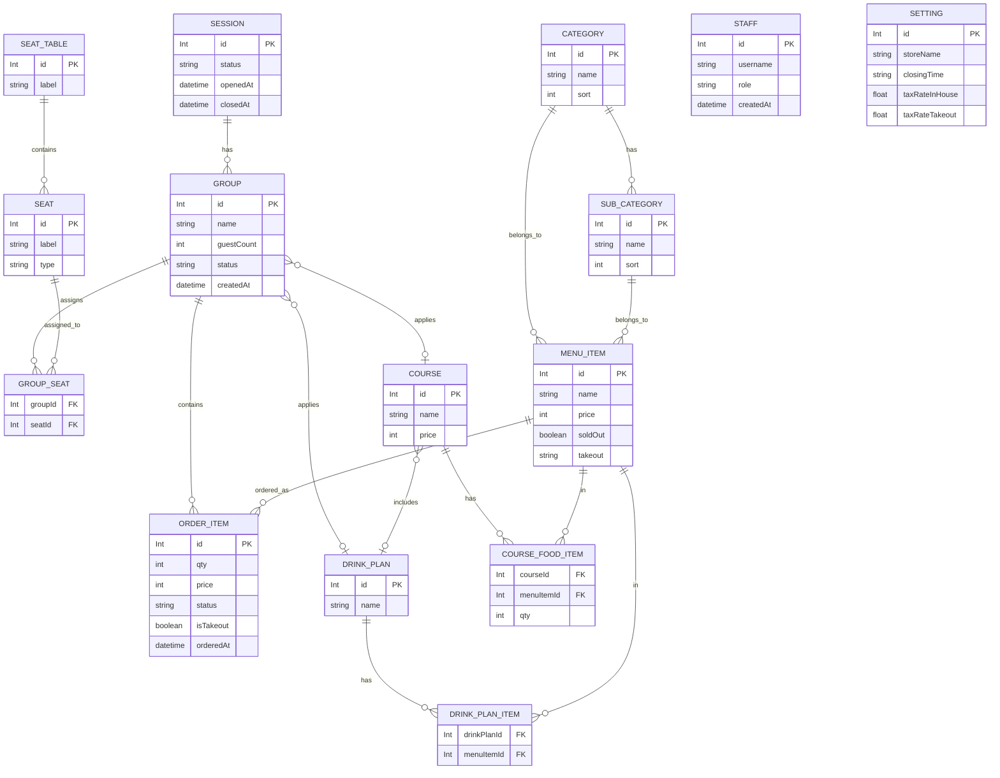

# Data Model — Overview

## Purpose

ドメインモデルの要約。実装は backend/prisma/schema.prisma を一次ソースとして参照する。

## Audience

バックエンド実装者、フロント実装者、DB 管理者

## Summary

主要モデル（Prisma schema 準拠）:

- Session: 営業セッション（開始/終了）
- SeatTable / Seat: 座席レイアウトと席
- Category / SubCategory / MenuItem: メニュー構成
- DrinkPlan / DrinkPlanItem: ドリンクプランと対象メニュー
- Course / CourseFoodItem: コースメニューと含まれる料理
- Group / GroupSeat: 来店グループと席割当て
- OrderItem: 注文明細（Order モデルは存在しない。明細が直接 Group に紐づく）
- Staff: スタッフ、権限
- Setting: アプリ設定（税率・店舗情報）

## Notes

詳細は backend/prisma/schema.prisma を参照。API 仕様（docs/api）と整合させること。モデル間の外部キー／制約は schema ファイルを優先する。

## ER Diagram (Mermaid)

Note: 詳細なフィールド、制約、インデックスは backend/prisma/schema.prisma を参照する。
