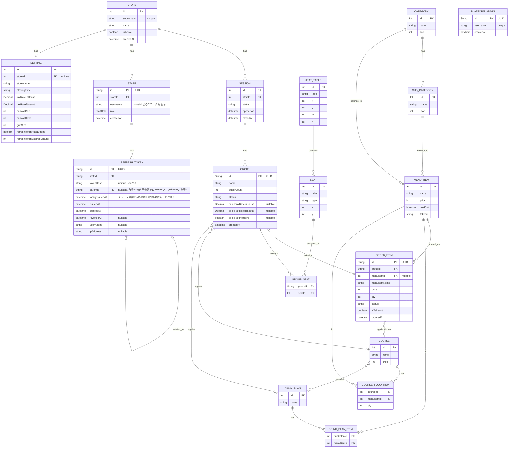

# データモデル概要

order-system のドメインモデル全体像。実装は [`backend/prisma/schema.prisma`](../../backend/prisma/schema.prisma) を一次ソースとする。外部キー・制約・インデックスは schema ファイルを優先する。API 仕様（[endpoints](../api/endpoints/index.md)）と整合させること。

## 主要モデル

Prisma schema 準拠。

- **Store**: 店舗（テナント）。`subdomain` でサブドメイン識別。マルチテナンシーは pool 型（共有 DB・共有アプリ、`storeId` 列による行レベル分離）。
- **PlatformAdmin**: プラットフォーム運営側の管理者。`Store` に紐づかない独立したアカウント（予約サブドメイン `admin` 配下で運用）。
- **Session**: 営業セッション（開始/終了）。`storeId` を持つ。
- **SeatTable / Seat**: 座席レイアウトと席。`storeId` を持つ。
- **Category / SubCategory / MenuItem**: メニュー構成。`storeId` を持つ。
- **DrinkPlan / DrinkPlanItem**: ドリンクプランと対象メニュー。`DrinkPlanItem` は中間テーブルのため `storeId` なし、親経由でスコープする。
- **Course / CourseFoodItem**: コースメニューと含まれる料理。`CourseFoodItem` も同様に `storeId` なし。
- **Group / GroupSeat**: 来店グループと席割当て。`GroupSeat` は複合 PK の中間テーブルのため `storeId` なし。
- **OrderItem**: 注文明細。Order モデルは存在せず、明細が直接 Group に紐づく。`storeId` を持つ。
- **Staff**: スタッフ、権限。`storeId` を持つ。`username` は店舗ごとにユニーク（`@@unique([storeId, username])`）。
- **RefreshToken**: リフレッシュトークン（使い捨てローテーション、親子チェーンで再利用検知）。`staffId` 経由で常に一意のため `storeId` なし。
- **Setting**: アプリ設定（税率・店舗情報・リフレッシュトークン方式）。`storeId Int @unique` で店舗ごとに 1 行（one-to-one）。

モデル別のフィールド・カスケード・インデックスは [prisma-summary.md](prisma-summary.md) を参照する。

## マルチテナンシー

- **アーキテクチャ**: pool 型。`Store`/`PlatformAdmin` を除く主要モデルに `storeId` 列を追加し、行レベルで論理分離する。
- **店舗の識別**: サブドメイン（`store1.example.com` 等）。予約サブドメイン `admin` はプラットフォーム管理者専用。
- **解決ロジック**: 詳細は [platform エンドポイント](../api/endpoints/platform.md) および [`backend/src/lib/store.ts`](../../backend/src/lib/store.ts) を参照する。

## ER 図

詳細なフィールド、制約、インデックスは [`backend/prisma/schema.prisma`](../../backend/prisma/schema.prisma) を参照する。
