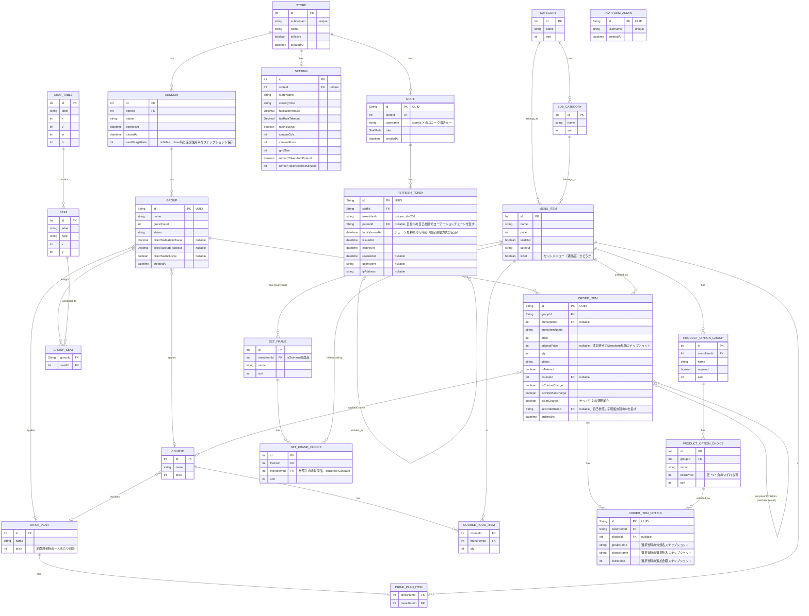

# データモデル概要

order-system のドメインモデル全体像。実装は [`backend/prisma/schema.prisma`](../../backend/prisma/schema.prisma) を一次ソースとする。外部キー・制約・インデックスは schema ファイルを優先する。API 仕様（[endpoints](../api/endpoints/index.md)）と整合させること。

## 主要モデル

Prisma schema 準拠。

- **Store**: 店舗（テナント）。`subdomain` でサブドメイン識別。マルチテナンシーは pool 型（共有 DB・共有アプリ、`storeId` 列による行レベル分離）。
- **PlatformAdmin**: プラットフォーム運営側の管理者。`Store` に紐づかない独立したアカウント（予約サブドメイン `admin` 配下で運用）。
- **Session**: 営業セッション（開始/終了）。`storeId` を持つ。
- **SeatTable / Seat**: 座席レイアウトと席。`storeId` を持つ。
- **Category / SubCategory / MenuItem**: メニュー構成。`storeId` を持つ。`isSet` はセットメニュー（親商品）かどうかを表す（後述の `SetFrame` を参照）。
- **ProductOptionGroup / ProductOptionChoice**: 商品オプション（例:「氷の状態」分類と「ロック」「ソーダ」選択肢）。`MenuItem` に専属で紐づく（商品間で共有しない）。`storeId` を持つ。
- **SetFrame / SetFrameChoice**: セットメニューの内訳分類（例:「ラーメン」枠）と、枠に登録された既存商品への参照（選択肢）。`isSet: true` の `MenuItem` に紐づく。`storeId` を持つ。`SetFrameChoice.menuItemId` は他モデルの中間テーブル（`CourseFoodItem`/`DrinkPlanItem`）と異なり `onDelete: Cascade`（参照先商品が削除されると選択肢も自動的に消える。削除自体はブロックしない）。
- **DrinkPlan / DrinkPlanItem**: ドリンクプランと対象メニュー。`DrinkPlanItem` は中間テーブルのため `storeId` なし、親経由でスコープする。
- **Course / CourseFoodItem**: コースメニューと含まれる料理。`CourseFoodItem` も同様に `storeId` なし。
- **Group / GroupSeat**: 来店グループと席割当て。`GroupSeat` は複合 PK の中間テーブルのため `storeId` なし。`status` が `closed` に遷移する時点（会計確定時）の税率・税込設定を `billedTaxRateInHouse` / `billedTaxRateTakeout` / `billedTaxInclusive` にスナップショットする（注文作成時点ではまだ未確定）。
- **OrderItem**: 注文明細。Order モデルは存在せず、明細が直接 Group に紐づく。`storeId` を持つ。`menuItemId` を持つ明細は注文作成時点の `MenuItem.price` を `originalPrice` に常時スナップショットする（コース/飲み放題のゼロ化解除時の価格復元に使用）。`isCourseCharge` / `isDrinkPlanCharge` はコース・飲み放題の定額課金明細かどうかを表す。`isSetCharge` はセット注文の親明細（セット価格で課金、作成時点で `status: 'served'`）かどうかを表す。`setOrderItemId` は自己参照 FK で、セットの内訳（子明細、`price: 0`）が親明細の `id` を指す（`courseId` のようなテンプレートID方式ではなく、注文インスタンス単位の紐付け。同じセットを何度も別の内訳で注文しても混ざらない）。
- **OrderItemOption**: 注文明細に紐づく、選択されたオプションのスナップショット（`groupName`/`choiceName`/`extraPrice`を選択当時の値で保持）。`ProductOptionChoice` への参照は `onDelete: SetNull`（選択肢が後から削除されても過去の注文明細は不変）。
- **Staff**: スタッフ、権限。`storeId` を持つ。`username` は店舗ごとにユニーク（`@@unique([storeId, username])`）。
- **RefreshToken**: リフレッシュトークン（使い捨てローテーション、親子チェーンで再利用検知）。`staffId` 経由で常に一意のため `storeId` なし。
- **Setting**: アプリ設定（税率・税込/税別モード・店舗情報・リフレッシュトークン方式）。`storeId Int @unique` で店舗ごとに 1 行（one-to-one）。`taxInclusive` で消費税の税込表示モードを切り替える。

モデル別のフィールド・カスケード・インデックスは [prisma-summary.md](prisma-summary.md) を参照する。

## マルチテナンシー

- **アーキテクチャ**: pool 型。`Store`/`PlatformAdmin` を除く主要モデルに `storeId` 列を追加し、行レベルで論理分離する。
- **店舗の識別**: サブドメイン（`store1.example.com` 等）。予約サブドメイン `admin` はプラットフォーム管理者専用。
- **解決ロジック**: 詳細は [platform エンドポイント](../api/endpoints/platform.md) および [`backend/src/lib/store.ts`](../../backend/src/lib/store.ts) を参照する。

## ER 図

詳細なフィールド、制約、インデックスは [`backend/prisma/schema.prisma`](../../backend/prisma/schema.prisma) を参照する。
